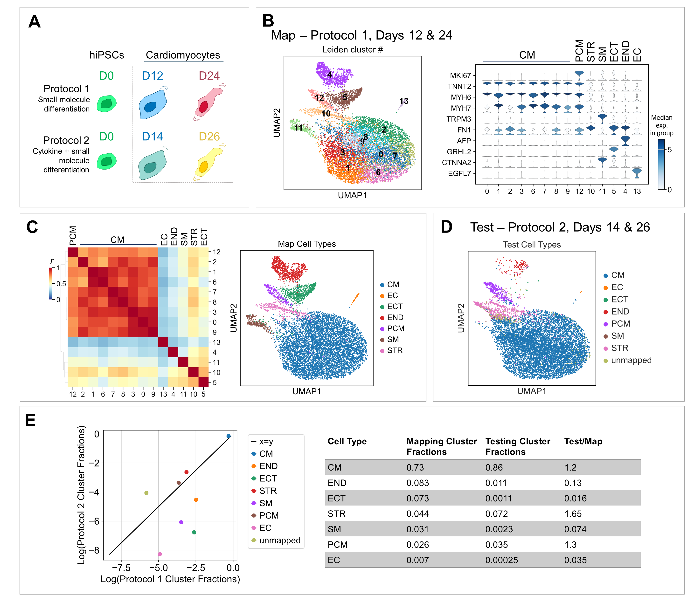

# scCompare

Measure the similarity of cells from 2 different single-cell RNAseq datasets.

# Overview

scCompare provides cell similarity measurements between 'test' and 'mapping' scRNAseq datasets. It is agnostic of known cell types, taking into account only data from the 'mapping' dataset. It includes:

- plots to visualize similarity and correlation between cells
- 'unmapped' annotations for cells that do not pass a similarity cutoff
- statistical metrics

# Nomenclature

Some nomenclature that may be non-intutitve is described here:

__user annotation__ = user-defined cell annotations in the mapping dataset

__assigned annotation__ (`asgd_cluster`) = annotation with cutoff

__raw annotation__ (`canon_label_asgd`) = annotation without cutoff

# Basic installation

Make sure you are using a recent version of pip, so first

`pip install -U pip`

then

`pip install git+https://github.com/bluerocktx/bfx-scCompare`

# Resources

- Check out our [vignette](https://github.com/bluerocktx/bfx-scCompare/blob/main/vignette.ipynb) here to walk through an example of how to use scCompare.

